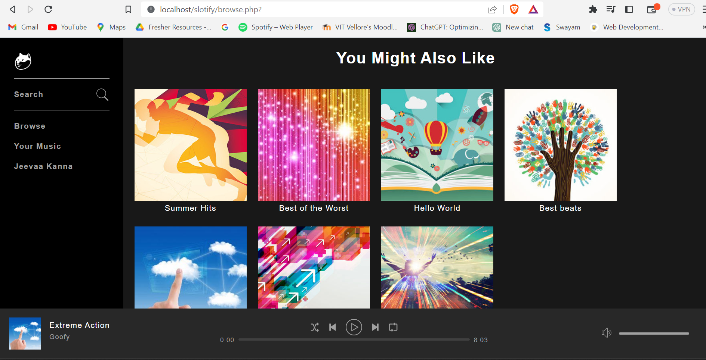

# Slotify

Slotify is an online music player like Spotify, built using HTML, CSS, JavaScript, PHP, and MySQL. It provides various features for users to manage and play their music library.



## Features

- User registration and authentication: Users can create accounts, log in, and manage their profiles.
- Music library: Users can upload and organize their music files, create playlists, and manage song metadata.
- Search and browse: Users can search for songs, albums, and artists, and explore different genres.
- Music playback: Users can play, pause, skip, and control the volume of the music.
- Favorites and playlists: Users can mark songs as favorites and create custom playlists.

## Installation

```shell
#Clone the repository
git clone https://github.com/jeevsssss/slotify.git

# Set up the database
# Create a MySQL database and import the `database.sql` file included in the project.
# Update the database credentials in the `config/config.php` file with your own.

# Start a local web server
# Use tools like XAMPP, WAMP, or MAMP to set up a local web server environment.
# Place the cloned repository into the appropriate directory for your local web server setup.

# Access the application
# Open a web browser and navigate to `http://localhost/slotify` (or the appropriate URL, depending on your server configuration).

```
## Usage

- Launch the Slotify application in your web browser.
- Register a new account or log in with your existing account.
- Upload your music files to the music library.
- Create playlists and add songs to them.
- Search for songs, albums, and artists using the search functionality.
- Play, pause, skip, and control the volume of the music playback.

## Technologies Used

- HTML
- CSS
- JavaScript
- PHP
- Mysql
- server : XAMPP

## License

This project is licensed under the [MIT License](LICENSE).
